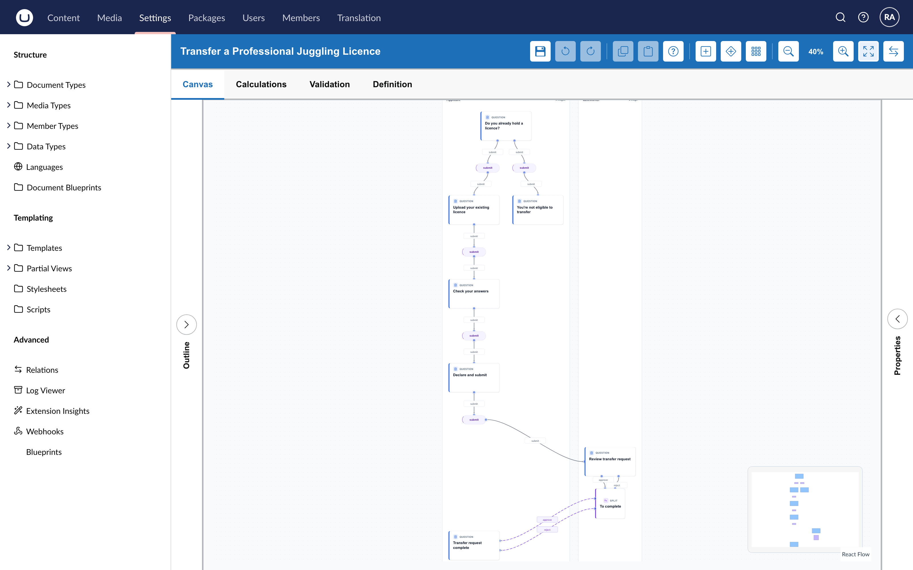
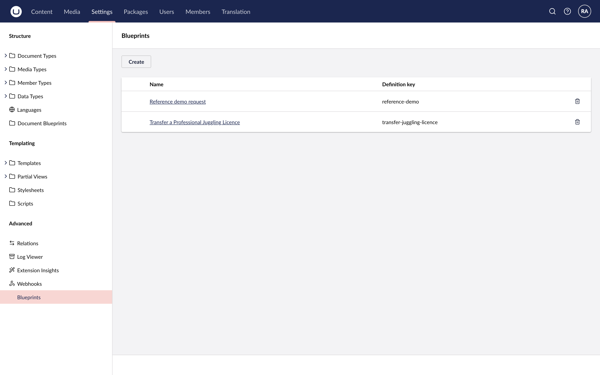
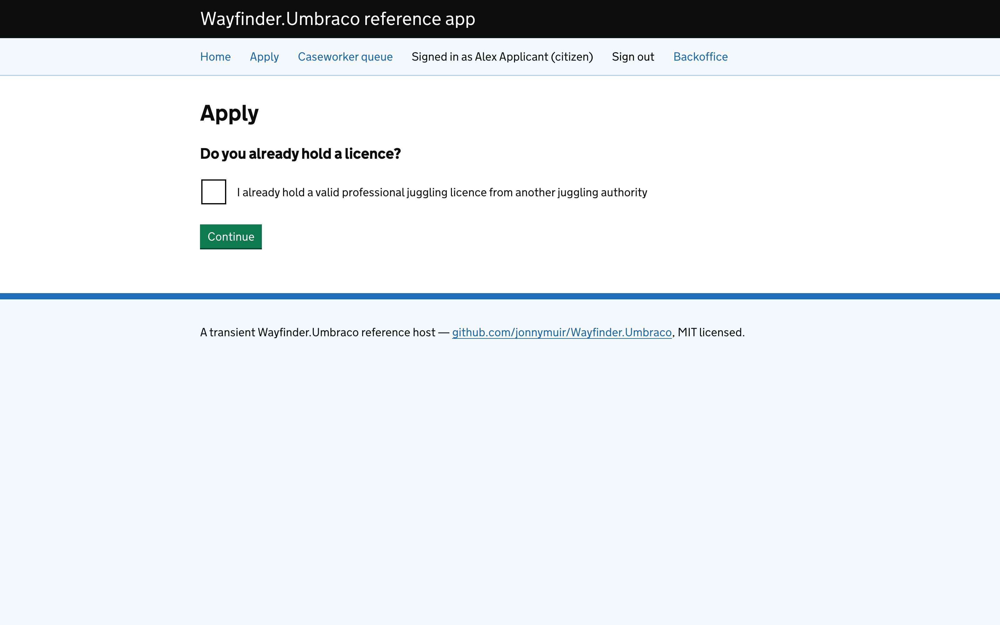
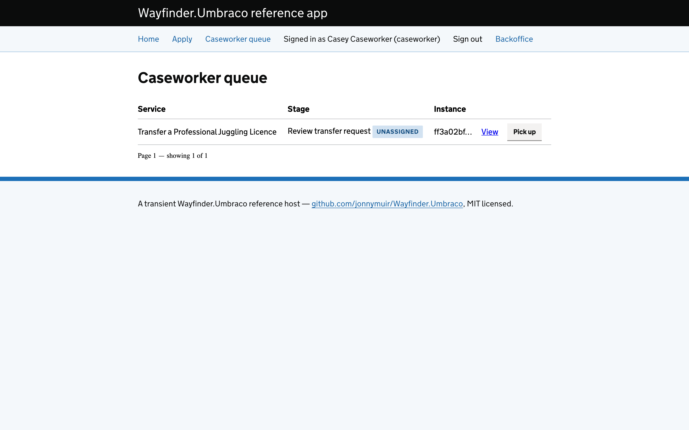

<picture>
  <source media="(prefers-color-scheme: dark)" srcset="assets/wordmark-umbraco-dark.png">
  
</picture>

[](https://github.com/jonnymuir/Wayfinder.Umbraco/actions/workflows/ci.yml)
[](https://www.nuget.org/packages/Wayfinder.Umbraco)
[](LICENSE)

**Wayfinder for Umbraco puts service design into the CMS your team already runs.** Describe a
public-facing service, get a working GOV.UK-styled journey with a caseworker queue behind it, and
compose it onto a page like any other Umbraco content.

It is the Umbraco host for [Wayfinder](https://github.com/jonnymuir/Wayfinder), a service
blueprint and service-design engine.

## Design it. See it. Run it.

| | |
|---|---|
| **Design it** | Author a service blueprint: the stages a person moves through, the decisions between them, and the queues your team works from. Use the visual editor, or design it in conversation with an AI partner over MCP. |
| **See it** | A blueprint is content in Umbraco. Drop the stage block onto a page and it renders as a real GOV.UK journey. Changing the journey is a content change, not a redeploy. |
| **Run it** | The in-process engine routes each request, evaluates the decision points, and holds work in the right queue. The worklist block gives caseworkers pickup, filtering, and paging. |



## What it's for

Wayfinder for Umbraco is for teams that design and run public-facing services and have chosen
Umbraco as their platform. It helps you:

- **Turn a service design into something people can use**, without a separate workflow product or a
  bespoke build for every form.
- **Keep the design and the running service in one place**, so a change to the journey is reviewed
  and published the way your team already reviews and publishes content.
- **Give caseworkers a real queue**, on the same access rules and rendering pipeline as the
  citizen-facing side.

It follows established practice rather than inventing its own. The model is the service blueprint
as the [Nielsen Norman Group defines it](https://www.nngroup.com/articles/service-blueprints-definition/)
(Sarah Gibbons, 2017): a user journey laid out across customer actions, frontstage, backstage, and
support processes, divided by the lines of interaction, visibility, and internal interaction. Those
horizontal lanes are the `queues` in a Wayfinder blueprint, each a lane of work owned by a team or
system, which the caseworker worklist block renders. Journeys are built to the
[GDS Service Standard](https://www.gov.uk/service-manual/service-standard), and components rendered
with the real GOV.UK Design System to [WCAG 2.2 AA](https://www.w3.org/TR/WCAG22/).


*The model is the [Nielsen Norman Group service blueprint](https://www.nngroup.com/articles/service-blueprints-definition/)
(Sarah Gibbons, 2017). See the article for Gibbons' own worked example.*

## Design in conversation, over MCP

The visual editor is one way to author a blueprint. The other is to describe the service in plain
language to an AI design partner and have it build the blueprint, then refine it with you.

Wayfinder for Umbraco exposes its authoring tools over the
[Model Context Protocol](https://modelcontextprotocol.io). MCP is an open standard, so the design
partner can be Claude Code or any other agent or harness that speaks it. The agent connects by
logging into the Umbraco backoffice with the standard OAuth flow, so its permissions are the
permissions of the person who authorised it.

The loop stays in domain language throughout:

1. **Describe** the problem, the user need, and the rules, the way you would to a colleague.
2. **Generate**: the agent drafts stages, decision points, uploads, and review steps, and
   validates them against the engine.
3. **Refine**: it asks clarifying questions, you answer in plain terms, it revises. When it saves,
   the blueprint is live in Umbraco.

Then you publish it to a page, open it in the visual editor to see what the words became, and run
it as an applicant and a caseworker.

- **Walkthrough:** [`docs/mcp-authoring-walkthrough.md`](docs/mcp-authoring-walkthrough.md) runs
  the whole cycle step by step against the reference app.
- **Video:** the same walkthrough recorded as one continuous take (see `tests/demo/`).



## What you get

Install the package and call `AddWayfinderUmbraco()`:

- **A service blueprint store**, DB-backed (`wayfinderServiceBlueprint`) and uSync-portable, with
  its own package migration so the table and the two building blocks are created on install.
- **Two Block Grid blocks**, composable onto any content page like any other block.
  `wayfinderServiceRequestStage` is the citizen-facing journey: GOV.UK components, file upload,
  GetCurrent and Advance. `wayfinderServiceRequestWorklist` is the caseworker queue: pickup and
  putback, filtering, paging, and rendering a picked item inline through the same pipeline the
  stage block uses.
- **A "Blueprints" authoring UI** under Umbraco's built-in Settings section (Advanced group), with
  no host wiring and nothing to grant on startup. The authoring API enforces its own boundary on
  top (`WayfinderAdminHandler`, configurable via `WayfinderServiceDesignOptions.AdminGroupAliases`).
- **The authoritative engine, in process.** Queue routing, decision-point evaluation, and request
  persistence run where Umbraco runs. There is no remote service to proxy to.
- **Multi-queue support.** A blueprint declares as many queues as it needs; each block renders only
  what the signed-in actor's `ActorProfile` can see.
- **A GOV.UK component and field catalog** (`Views/Partials/_WayfinderComponents` /
  `_WayfinderFields`), overridable one type at a time by placing a same-named partial in your own
  app.
- **The supporting infrastructure**: nonce handling, file upload, field validation, and live
  workflow-state polling, so a waiting or join-gateway screen updates in place instead of needing a
  manual refresh.





## What a host still owns

Wayfinder for Umbraco has no multi-tenancy or auth opinion of its own. A host wires:

- **Identity and tenancy**, via `WayfinderServiceDesignOptions.ResolveTenantId` / `ResolveUserId` /
  `ResolveAccessProfile` (all required).
- **The polling policy.** The live-update endpoint (`ServiceRequestPollController`) sits behind the
  `WayfinderUmbracoAuthorizationPolicies.ServiceRequestPolling` named policy; register it against
  the authentication scheme your host uses. Without it, waiting screens fall back to a manual
  refresh. `Wayfinder.Umbraco.ReferenceApp/ReferenceAppComposer.cs` is a minimal working example.

## Reference app

[`Wayfinder.Umbraco.ReferenceApp`](Wayfinder.Umbraco.ReferenceApp/README.md) is a real, bootable
Umbraco 17 site that runs this package end to end: the citizen stage block, the caseworker
worklist, pickup and putback, access control, and the MCP authoring surface. Backoffice and demo
logins are documented there.

## How it fits together

- **[`Wayfinder`](https://github.com/jonnymuir/Wayfinder)** is the framework-agnostic core: the
  domain model, the calculation engine, and the state-machine engine. No Umbraco, no hosting
  assumptions.
- **`Wayfinder.Umbraco`** (this package) is the Umbraco host: the store, the blocks, the authoring
  UI, and the GOV.UK rendering.
- **[Umbraco Prism](https://github.com/jonnymuir/Umbraco.Prism)** is the reference consumer for
  multi-tenancy and branding. `UmbracoPrism.Core` carries no service-design opinion; only its test
  site installs this package.

All three publish to nuget.org, the only source this package restores or publishes against.

## Depends on

- [`Wayfinder`](https://github.com/jonnymuir/Wayfinder): domain models, calculation engine.
- [`Wayfinder.Engine`](https://github.com/jonnymuir/Wayfinder): the state-machine engine.

## Building

```bash
dotnet build Wayfinder.Umbraco.slnx
dotnet pack Wayfinder.Umbraco.slnx
```

## License

MIT, see [LICENSE](LICENSE).
